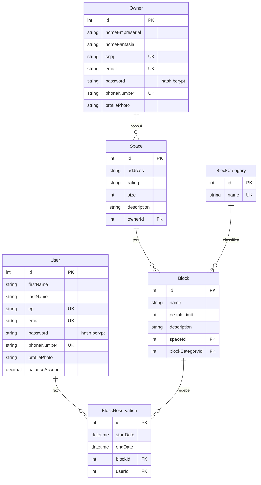

# Coworking — backend

[](https://github.com/j-andrade0/COWorking/actions/workflows/ci.yml)

> **English summary:** REST API for managing and booking coworking spaces (users, space owners, spaces, rooms/desks and
> time-slot reservations with overlap validation). Built with Node.js 20, Express, Sequelize, MySQL, JWT and bcrypt, with
> Swagger docs, ESLint/Prettier, Vitest + supertest tests, GitHub Actions CI and a Docker Compose setup. It was the back
> end of my final course project (TCC) for the Software Engineering degree, written in 2023 (135 commits, issue → branch
> → PR → merge); in 2026 I added JWT-protected routes, shared pagination, date-based reservation validation, tests, CI
> and Docker. The mobile app was built by a colleague and is not in this repository. Quick start: `cp backend/.env.example backend/.env`, edit it, then
> `docker compose --env-file backend/.env up --build` and open <http://localhost:3000/doc/>.

Backend de uma plataforma para gerenciar e reservar espaços de coworking, pagos ou gratuitos. Foi o meu Trabalho de
Conclusão de Curso (TCC) de Engenharia de Software, desenvolvido entre março e novembro de 2023. O histórico de commits
(issue → branch → PR → merge) é o original de 2023. Em outubro de 2026 acrescentei, sempre em PRs novos e sem reescrever
o histórico: rotas protegidas por JWT, paginação compartilhada, validação de reservas com datas, configuração por
variáveis de ambiente (`.env.example`), Docker Compose, testes automatizados (Vitest e supertest) e CI no GitHub Actions.

## Stack

Node.js 20 · Express 4 · Sequelize 6 · MySQL 8 · JWT (`jsonwebtoken`) · bcrypt · Swagger (`swagger-autogen` +
`swagger-ui-express`) · ESLint · Prettier · Vitest + supertest · Docker Compose · GitHub Actions

## Como rodar do zero

### Com Docker (um comando)

```sh
cp backend/.env.example backend/.env      # edite DB_PASSWORD e JWT_SECRET_KEY
docker compose --env-file backend/.env up --build
```

Sobe um MySQL 8 (com healthcheck) e a API; a API espera o banco ficar saudável. A documentação fica em
<http://localhost:3000/doc/>.

### Sem Docker

Pré-requisitos: Node.js 20 e um MySQL acessível, com o banco (`DB_NAME`) já criado.

```sh
cd backend
npm ci
cp .env.example .env     # edite os valores (use aspas simples se tiverem $ ou outros caracteres de shell)
npm run dev              # carrega o .env, gera o Swagger e inicia com nodemon (precisa de bash)
# ou: set -a; . ./.env; set +a; npm start
```

As tabelas são criadas pelo Sequelize na primeira execução (`db.sync()`). Dados de exemplo fictícios estão em
[`backend/src/sqlInsert.sql`](backend/src/sqlInsert.sql) (rode depois de subir a API uma vez; senha de demonstração:
`demo-password`). A coleção [`insomnia-coworking.json`](insomnia-coworking.json) tem as requisições.

### Variáveis de ambiente

| Variável         | Descrição                                                                |
| ---------------- | ------------------------------------------------------------------------ |
| `DB_NAME`        | nome do banco MySQL                                                      |
| `DB_USER`        | usuário do banco                                                         |
| `DB_PASSWORD`    | senha do banco                                                           |
| `DB_HOST`        | host do banco (`localhost` por padrão; `mysql` dentro do Docker Compose) |
| `JWT_SECRET_KEY` | chave usada para assinar os tokens; o servidor não sobe sem ele          |
| `PORT`           | porta da API (padrão `3000`)                                             |
| `DB_DIALECT`     | opcional; `sqlite` usa um banco em memória (é o que os testes usam)      |

## Autenticação

`POST /userLogin` e `POST /ownerLogin` devolvem `{ "jwtToken": "..." }` (validade de 1 hora). Envie o token no header
`Authorization`, puro ou como `Bearer <token>`. O token carrega `id` e `role` (`user` ou `owner`). Sem token, token
inválido ou expirado a resposta é `401`.

## Endpoints

Acesso: **público** = sem token; **JWT** = header `Authorization`. O Swagger em `/doc` é a referência completa.

| Recurso            | Rotas                                                                                                                                    | Acesso  |
| ------------------ | ---------------------------------------------------------------------------------------------------------------------------------------- | ------- |
| Usuário            | `POST /users`, `POST /userLogin`                                                                                                         | público |
| Usuário            | `GET /users`, `GET /users/:id`, `GET /users/validateUser?email=`, `GET /users/reservations/:id`, `PATCH /users/:id`, `DELETE /users/:id` | JWT     |
| Dono de espaço     | `POST /owners`, `POST /ownerLogin`                                                                                                       | público |
| Dono de espaço     | `GET /owners`, `GET /owners/:id`, `PATCH /owners/:id`, `DELETE /owners/:id`                                                              | JWT     |
| Espaço             | `GET/POST /spaces`, `GET/PATCH/DELETE /spaces/:id`                                                                                       | JWT     |
| Categoria de bloco | `GET/POST /blockCategory`, `GET/PATCH/DELETE /blockCategory/:id`                                                                         | JWT     |
| Bloco (sala/mesa)  | `GET/POST /block`, `GET/PATCH/DELETE /block/:id`, `GET /block/reservations/:id`                                                          | JWT     |
| Reserva            | `GET/POST /blockReservation`, `GET/PATCH/DELETE /blockReservation/:id`                                                                   | JWT     |
| Documentação       | `GET /doc`                                                                                                                               | público |

As listagens são paginadas (`?page=N`, 10 itens) e devolvem `pagination` com `prev_page`, `next_page`, `lastPage` e
`totalRegisters`.

A reserva (`POST`/`PATCH /blockReservation`) valida que o usuário e o bloco existem, que a data inicial é menor que a
final e que não há sobreposição com outra reserva do mesmo bloco (começa dentro, termina dentro ou envolve); reservas
encostadas (uma termina quando a outra começa) são permitidas.

## Modelo de dados



## Testes e qualidade

```sh
cd backend
npm run lint          # ESLint (inclui no-undef)
npm run format:check  # Prettier
npm test              # Vitest + supertest, banco SQLite em memória (não precisa de MySQL nem de .env)
```

O GitHub Actions roda isso em Node 20 e, em outro job, sobe o `docker compose` com MySQL de verdade e faz um teste de
fumaça (documentação, cadastro, login e rota protegida).

## Próximos passos

- Extrair um controller/serviço base para o CRUD dos controllers e adicionar esquemas de validação do corpo das requisições.
- Migrar de `db.sync()` para migrations do Sequelize.
- Ampliar os testes automatizados para todos os controllers.
- Implementar o fluxo de pagamentos e de saldo (`balanceAccount`), hoje apenas um campo do modelo.

## Autores

- José Antonio de Andrade Siqueira — backend — [@j-andrade0](https://github.com/j-andrade0)
- Danilo Araujo Silva — mobile (não está neste repositório) — [@Dan0Silva](https://github.com/Dan0Silva)
